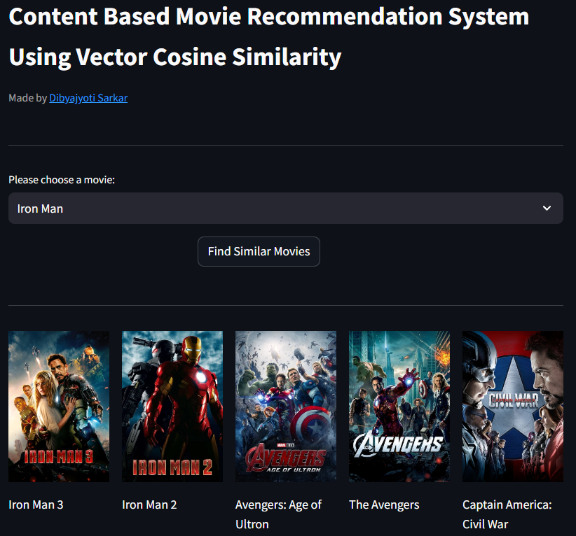

# Content Based Movie Recommendation System Using Scikit-Learn

This application provides content based movie recommendations using vector cosine similarity.

You can experience the demo of this app [here](https://djsarkar93-cbmovrcmndr.streamlit.app/).




## Run Locally

To run the application on your local machine, execute the following commands:

- Clone the project
  ```bash 
  git clone https://github.com/djsarkar93/content-based-movie-recommender/main
  ```
- Go to the project directory
  ```bash
  cd content-based-movie-recommendation-system
  ```
- Create a python virtual environment
  ```bash
  python -m venv venv
  ```
- Activate the virtual environment and install the following libraries
  ```bash
  source venv/bin/activate
  ```
  ```bash
  pip install -r requirements.txt
  ```
- Start the application
  ```bash
  streamlit run app.py
  ```

## Credits

- [Dibyajyoti Sarkar](https://www.linkedin.com/in/djsarkar93)


## License

This project is licensed under the [MIT](https://choosealicense.com/licenses/mit/) License.
